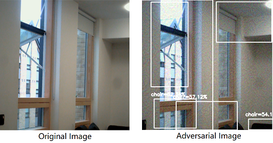
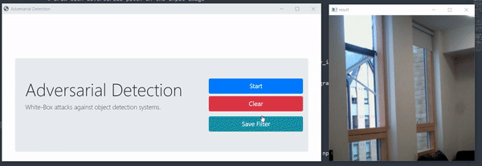
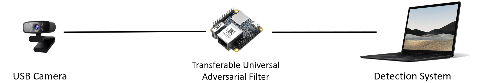

# Real-time Adversarial Attacks against Embedded Object Detection System using a Microkernel OS

> Is Deep Learning secure for Robots?

## Introduction

Deep Neural Networks achieve SOTA performance in object detection tasks and have been widely adopted in industrial applications. However, according to recent research, deep neural networks are vulnerable to adversarial attacks, which means we can manipulate the output of the detection model by adding small perturbations to the original input image.

For example, after adding some perturbations to the original image (left), the YOLO detection model detects several chairs on the window (right), which is ridiculous. It turns out that the generation of adversarial perturbation is trivial. It takes only several seconds to generate the perturbation [1].

The perturbation above is perceivable by human eyes. It is also possible to make the perturbation unperceivable. Imagine what will happen if we apply the perturbation to an autonomous driving car? It detects bottles and chairs everywhere on the road, which could be a critical threat to the navigation system [2].

However, it is not easy to obtain access to a real-world autonomous driving system and apply the attack. So the question is, how do we apply the perturbation to the camera without access to the navigation system? The answer is, we can apply a man-in-the-middle attack to the camera used by the detection system.

## Objective

This project aims to raise concerns over applications of deep neural networks in safety-critical systems, such as autonomous driving. Our objective is to demonstrate that we can attack an object detection system without access to its training set, its model, and the operating system. 

To apply the perturbation to a real-world detection system, we can inject the attack between the camera and the detection system. It proves possible to do this using a raspberry pi 4 that runs Linux [3]. The raspberry pi reads the original video stream from V4L2 devices, and stream the perturbed video data to the detection system as a simulated USB Camera. But this implementation takes several seconds to boot the Linux OS, and the efficiency of the attack is undermined because Linux is not a real-time operating system.

RT-Thread Smart, a microkernel operating system, could be a better choice for this project. It boots up in milliseconds and guarantees that high-priority tasks execute within precise time constraints. Besides, it is POSIX compliant and provides compatibility for Linux character devices.

## Tasks

To achieve our objective, we need to implement several functionalities:

- V4L2
- Image Processing
- UVC Gadget

## References

[1] Adversarial Detection: https://github.com/wuhanstudio/adversarial-detection

[2] Chow, Ka-Ho, et al. "Adversarial objectness gradient attacks in real-time object detection systems." *2020 Second IEEE International Conference on Trust, Privacy and Security in Intelligent Systems and Applications (TPS-ISA)*. IEEE, 2020.

[3] Adversarial Camera: https://github.com/wuhanstudio/adversarial-camera

